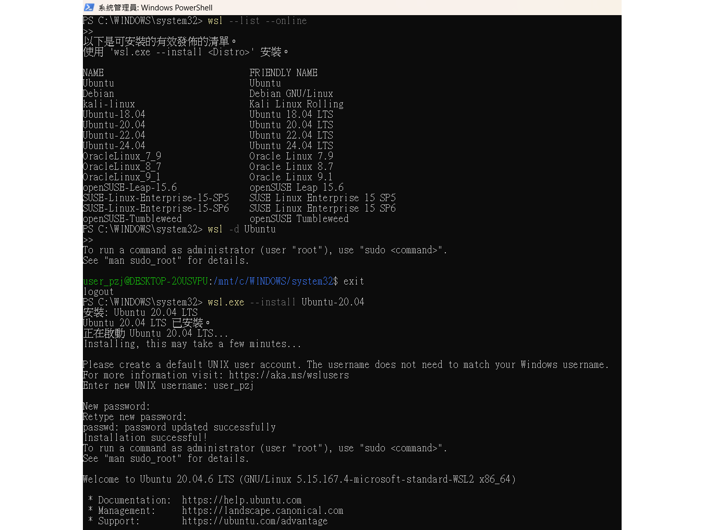
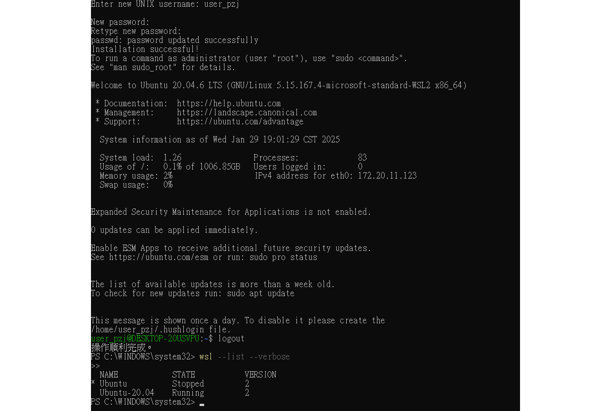

## WSL Ubuntu 和 Ubuntu 的差異

### 1. 運行環境
- **WSL Ubuntu**：在 Windows 上以子系統的形式運行，並與 Windows 共享資源（如檔案系統、網路等）。
- **Ubuntu（原生）**：作為獨立的作業系統運行，可以安裝在裸機或虛擬機（如 VirtualBox、VMware）上。

### 2. 系統核心（Kernel）
- **WSL Ubuntu**：
  - **WSL 1**：使用 Windows 內核進行轉譯，不是真正的 Linux 內核。
  - **WSL 2**：使用完整的 Linux 內核，透過輕量級虛擬機（Hyper-V）運行。
- **Ubuntu（原生）**：運行完整的 Linux 內核，完全由 Ubuntu 官方維護。

### 3. 系統資源使用
- **WSL Ubuntu**：共享 Windows 的 CPU、記憶體，資源分配較靈活，但效能受限於 WSL 內部架構。
- **Ubuntu（原生）**：完整控制硬體資源，通常效能較好，特別適合高效能計算和伺服器環境。

### 4. 圖形界面支援
- **WSL Ubuntu**：
  - **WSL 1** 需要額外安裝 X Server（如 VcXsrv）才能運行 GUI 應用程式。
  - **WSL 2** 支援 WSLg，內建 X Server，可直接運行 Linux GUI 應用。
- **Ubuntu（原生）**：完整支援圖形介面，包含 GNOME、KDE、XFCE 等。

### 5. 檔案系統與存取
- **WSL Ubuntu**：
  - 可直接存取 Windows 檔案（如 `/mnt/c` 可存取 C 槽）。
  - **WSL 2** 採用 VHD（虛擬硬碟）存儲 Linux 檔案，但仍可透過 `/mnt` 存取 Windows 檔案。
- **Ubuntu（原生）**：使用 ext4 等 Linux 檔案系統，需額外設定才能讀取 NTFS 或 Windows 檔案。

### 6. 應用與相容性
- **WSL Ubuntu**：適合開發、測試 Linux 應用，但某些低層級功能（如 `systemd` 在 WSL 1 不支援）可能受限。
- **Ubuntu（原生）**：完整支援 Linux 生態系統，包括所有核心服務（如 `systemd`、Docker 原生運行等）。

### 7. 適用場景
- **WSL Ubuntu**：
  - 開發人員需要在 Windows 中運行 Linux 命令行工具（如 `bash`、`grep`、`awk`）。
  - 需要在 Windows 和 Linux 之間快速切換。
  - 需要在 Windows 上運行某些 Linux 應用（如 Python、Node.js、Docker（WSL 2）等）。
- **Ubuntu（原生）**：
  - 需要完整的 Linux 環境（如伺服器、雲端運行、資料科學、高效能運算）。
  - 不需要與 Windows 深度整合。
  - 需要穩定的 Linux 內核和系統服務（如 `systemd`）。

## 總結
- **如果你主要在 Windows 開發且需要 Linux 命令行工具**，WSL Ubuntu 是很好的選擇。
- **如果你需要完整的 Linux 體驗**，或用於伺服器、桌面環境，原生 Ubuntu 更合適。

如果你正在考慮選擇 WSL 或 Ubuntu，取決於你的需求。如果是一般開發用途，WSL 2 + Ubuntu 是一個高效且方便的解決方案。

## Installation Example

