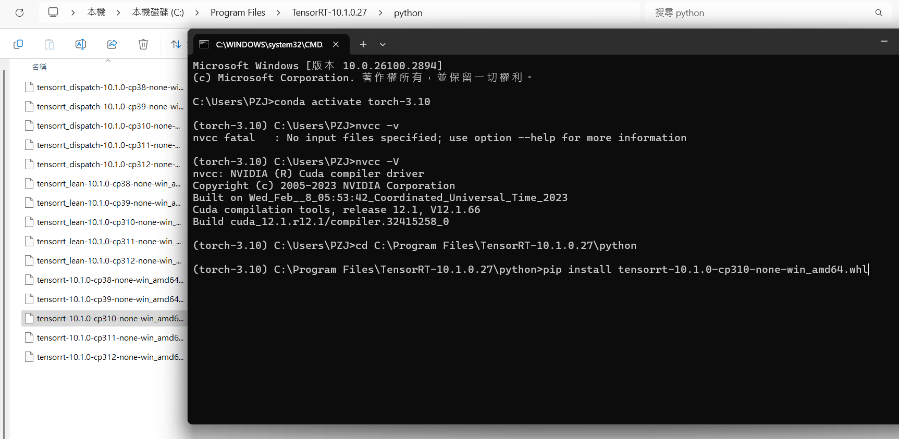

# YOLOv9 QAT for TensorRT  Detection / Segmentation  


This repository contains an implementation of YOLOv9 with Quantization-Aware Training (QAT), specifically designed for deployment on platforms utilizing TensorRT for hardware-accelerated inference. <br>
This implementation aims to provide an efficient, low-latency version of YOLOv9 for real-time detection applications.<br>
If you do not intend to deploy your model using TensorRT, it is recommended not to proceed with this implementation.

- The files in this repository represent a patch that adds QAT functionality to the original [YOLOv9 repository](https://github.com/WongKinYiu/yolov9/).
- This patch is intended to be applied to the main YOLOv9 repository to incorporate the ability to train with QAT.
- The implementation is optimized to work efficiently with TensorRT, an inference library that leverages hardware acceleration to enhance inference performance.
- Users interested in implementing object detection using YOLOv9 with QAT on TensorRT platforms can benefit from this repository as it provides a ready-to-use solution.


We use [TensorRT's pytorch quntization tool](https://github.com/NVIDIA/TensorRT/tree/main/tools/pytorch-quantization) to finetune training QAT yolov9 from the pre-trained weight, then export the model to onnx and deploy it with TensorRT. The accuray and performance can be found in below table.

For those who are not familiar with QAT, I highly recommend watching this video:<br> [Quantization explained with PyTorch - Post-Training Quantization, Quantization-Aware Training](https://www.youtube.com/watch?v=0VdNflU08yA)

## Getting started (工欲善其事，必先利其器)
For getting started, needs some steps.

&nbsp; **Git Download** 

&nbsp; [Git](https://git-scm.com/downloads)  
- Settings：[git_command](./git_command/git_command.pdf)


&nbsp; **Download Archive** 

&nbsp; [yolov9](https://github.com/WongKinYiu/yolov9)  
 
```
git clone https://github.com/WongKinYiu/yolov9.git
```
```
git status
```
```
git pull
```

&nbsp; [yolov9-qat](https://github.com/levipereira/yolov9-qat)  
 
```
git clone https://github.com/levipereira/yolov9-qat.git
```
```
git status
```
```
git pull
```

&nbsp; *CUDA / cudnn Info*

| Version         | Python version   | Compiler   | Build tools  | cuDNN | CUDA  |
|---------------|----------------|-----------|-------------|------|------|
| tensorflow-2.14.0 | 3.9-3.11       | Clang 16.0.0 | Bazel 6.1.0  | 8.7  | 11.8 |
| tensorflow-2.13.0 | 3.8-3.11       | Clang 16.0.0 | Bazel 5.3.0  | 8.6  | 11.8 |
| <span style="color:red">tensorflow-2.12.0</span> | <span style="color:red">3.8-3.11</span> | <span style="color:red">GCC 9.3.1</span> | <span style="color:red">Bazel 5.3.0</span> | <span style="color:red">8.6</span> | <span style="color:red">11.8</span> |
| tensorflow-2.11.0 | 3.7-3.10       | GCC 9.3.1  | Bazel 5.3.0  | 8.1  | 11.2 |
| tensorflow-2.10.0 | 3.7-3.10       | GCC 9.3.1  | Bazel 5.1.1  | 8.1  | 11.2 |
| tensorflow-2.9.0  | 3.7-3.10       | GCC 9.3.1  | Bazel 5.0.0  | 8.1  | 11.2 |
| tensorflow-2.8.0  | 3.7-3.10       | GCC 7.3.1  | Bazel 4.2.1  | 8.1  | 11.2 |
| tensorflow-2.7.0  | 3.7-3.9        | GCC 7.3.1  | Bazel 3.7.2  | 8.1  | 11.2 |
| tensorflow-2.6.0  | 3.6-3.9        | GCC 7.3.1  | Bazel 3.7.2  | 8.1  | 11.2 |
| tensorflow-2.5.0  | 3.6-3.9        | GCC 7.3.1  | Bazel 3.7.2  | 8.1  | 11.2 |
| tensorflow-2.4.0  | 3.6-3.8        | GCC 7.3.1  | Bazel 3.1.0  | 8.0  | 11.0 |
| tensorflow-2.3.0  | 3.5-3.8        | GCC 7.3.1  | Bazel 3.1.0  | 7.6  | 10.1 |
| tensorflow-2.2.0  | 3.5-3.8        | GCC 7.3.1  | Bazel 2.0.0  | 7.6  | 10.1 |
| tensorflow-2.1.0  | 2.7, 3.3-3.7   | GCC 7.3.1  | Bazel 0.27.1 | 7.6  | 10.1 |
| tensorflow-2.0.0  | 2.7, 3.3-3.7   | GCC 7.3.1  | Bazel 0.26.1 | 7.4  | 10.0 |

&nbsp; [CUDA](https://developer.nvidia.com/cuda-toolkit-archive)  &nbsp; [cudnn](https://developer.nvidia.com/rdp/cudnn-archive)  &nbsp; [pytorch](https://pytorch.org/)  &nbsp; [TensorRT](https://developer.nvidia.com/tensorrt/download)

## Implementation Environment
Windows11 + WSL_Ubuntu-20.04(LTS)  
**[Windows11](#Windows11)  / [WSL_Ubuntu-20.04(LTS) ](#WSL_Ubuntu-20.04(LTS))**
### Windows11

- Environment
    - python 3.10.16
    - CUDA 12.1
    - cudnn 8.8
    - pytorch    
    ```
    git clone https://github.com/levipereira/yolov9-qat.git
     ```
    - TensorRT 10.1.0
### TensorRT Installation Guide

1. Extract the downloaded files.

2. Set the necessary environment variables in the installation directory.

3. Add the `bin` and `lib` folders to the `PATH`.

4. Python_Building



    


