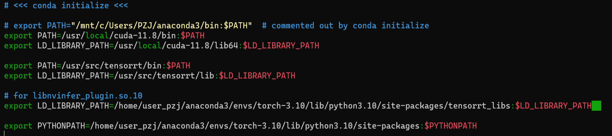
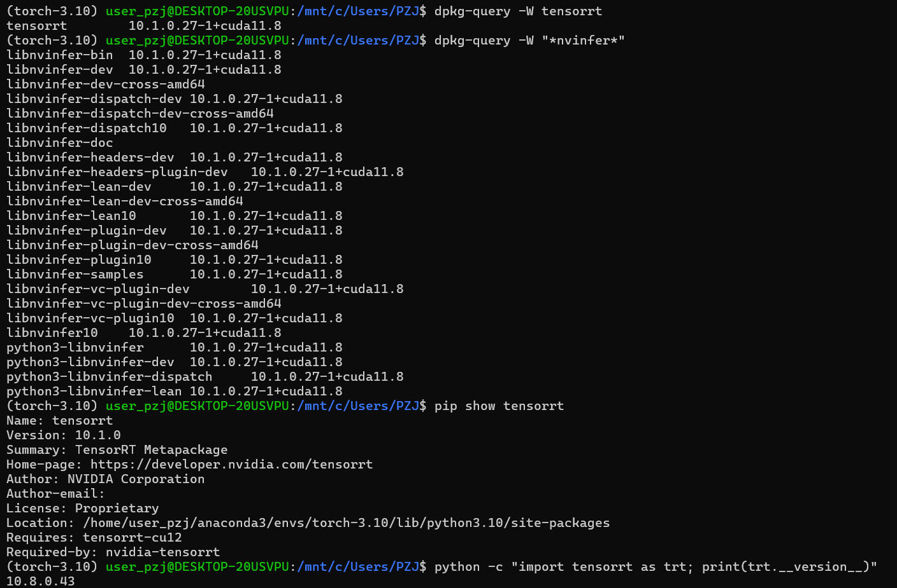
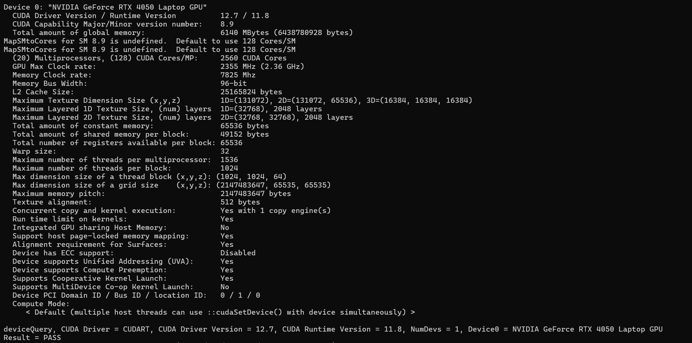
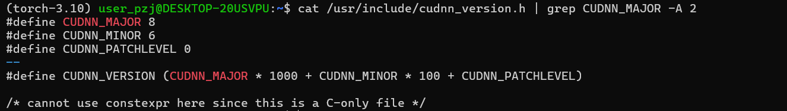

# YOLOv9 QAT for TensorRT  Detection / Segmentation  


This repository contains an implementation of YOLOv9 with Quantization-Aware Training (QAT), specifically designed for deployment on platforms utilizing TensorRT for hardware-accelerated inference. <br>
This implementation aims to provide an efficient, low-latency version of YOLOv9 for real-time detection applications.<br>
If you do not intend to deploy your model using TensorRT, it is recommended not to proceed with this implementation.

- The files in this repository represent a patch that adds QAT functionality to the original [YOLOv9 repository](https://github.com/WongKinYiu/yolov9/).
- This patch is intended to be applied to the main YOLOv9 repository to incorporate the ability to train with QAT.
- The implementation is optimized to work efficiently with TensorRT, an inference library that leverages hardware acceleration to enhance inference performance.
- Users interested in implementing object detection using YOLOv9 with QAT on TensorRT platforms can benefit from this repository as it provides a ready-to-use solution.


We use [TensorRT's pytorch quntization tool](https://github.com/NVIDIA/TensorRT/tree/main/tools/pytorch-quantization) to finetune training QAT yolov9 from the pre-trained weight, then export the model to onnx and deploy it with TensorRT. The accuray and performance can be found in below table.

For those who are not familiar with QAT, I highly recommend watching this video:<br> [Quantization explained with PyTorch - Post-Training Quantization, Quantization-Aware Training](https://www.youtube.com/watch?v=0VdNflU08yA)

# Getting started (工欲善其事，必先利其器)
For getting started, needs some steps.

## **Git Download** 

[Git](https://git-scm.com/downloads)  
- Settings：[git_command](./git_command/git_command.pdf)


## **Download Archive** 

[yolov9](https://github.com/WongKinYiu/yolov9)  
 
```
git clone https://github.com/WongKinYiu/yolov9.git
```
```
git status
```
```
git pull
```
[yolov9-qat](https://github.com/levipereira/yolov9-qat)  
 
```
git clone https://github.com/levipereira/yolov9-qat.git
```
```
git status
```
```
git pull
```

## **CUDA / cudnn Info**

Check the info and choose the best fit to your device.
```
nvidia-smi
```

| Version         | Python version   | Compiler   | Build tools  | cuDNN | CUDA  |
|---------------|----------------|-----------|-------------|------|------|
| tensorflow-2.14.0 | 3.9-3.11       | Clang 16.0.0 | Bazel 6.1.0  | 8.7  | 11.8 |
| tensorflow-2.13.0 | 3.8-3.11       | Clang 16.0.0 | Bazel 5.3.0  | 8.6  | 11.8 |
| <span style="color:red">tensorflow-2.12.0</span> | <span style="color:red">3.8-3.11</span> | <span style="color:red">GCC 9.3.1</span> | <span style="color:red">Bazel 5.3.0</span> | <span style="color:red">8.6</span> | <span style="color:red">11.8</span> |
| tensorflow-2.11.0 | 3.7-3.10       | GCC 9.3.1  | Bazel 5.3.0  | 8.1  | 11.2 |
| tensorflow-2.10.0 | 3.7-3.10       | GCC 9.3.1  | Bazel 5.1.1  | 8.1  | 11.2 |
| tensorflow-2.9.0  | 3.7-3.10       | GCC 9.3.1  | Bazel 5.0.0  | 8.1  | 11.2 |
| tensorflow-2.8.0  | 3.7-3.10       | GCC 7.3.1  | Bazel 4.2.1  | 8.1  | 11.2 |
| tensorflow-2.7.0  | 3.7-3.9        | GCC 7.3.1  | Bazel 3.7.2  | 8.1  | 11.2 |
| tensorflow-2.6.0  | 3.6-3.9        | GCC 7.3.1  | Bazel 3.7.2  | 8.1  | 11.2 |
| tensorflow-2.5.0  | 3.6-3.9        | GCC 7.3.1  | Bazel 3.7.2  | 8.1  | 11.2 |
| tensorflow-2.4.0  | 3.6-3.8        | GCC 7.3.1  | Bazel 3.1.0  | 8.0  | 11.0 |
| tensorflow-2.3.0  | 3.5-3.8        | GCC 7.3.1  | Bazel 3.1.0  | 7.6  | 10.1 |
| tensorflow-2.2.0  | 3.5-3.8        | GCC 7.3.1  | Bazel 2.0.0  | 7.6  | 10.1 |
| tensorflow-2.1.0  | 2.7, 3.3-3.7   | GCC 7.3.1  | Bazel 0.27.1 | 7.6  | 10.1 |
| tensorflow-2.0.0  | 2.7, 3.3-3.7   | GCC 7.3.1  | Bazel 0.26.1 | 7.4  | 10.0 |

&nbsp; [CUDA](https://developer.nvidia.com/cuda-toolkit-archive)  &nbsp; [cudnn](https://developer.nvidia.com/rdp/cudnn-archive)  &nbsp; [pytorch](https://pytorch.org/)  &nbsp; [TensorRT](https://developer.nvidia.com/tensorrt/download)

# Implementation Environment
Windows11 + [WSL](./md&pdf/About_WSL.pdf)_Ubuntu-20.04(LTS)  
**[Windows11](#Windows11)  / [WSL_Ubuntu-20.04-LTS](#wsl_ubuntu-20-04-lts)**
## Windows11

- Environment
    - python 3.10.16
    - CUDA 12.1
    - cudnn 8.8
    - pytorch    
    ```
    pip3 install torch torchvision torchaudio --index-url https://download.pytorch.org/whl/cu121
     ```
    - TensorRT 10.1.0
### TensorRT Installation Guide

1.Extract the downloaded files.

2.Set the necessary environment variables in the installation directory.

3.Add the `bin` and `lib` folders to the `PATH`.

4.Python_Building


<a id="wsl_ubuntu-20-04-lts"></a>
## WSL_Ubuntu-20.04(LTS)

- Environment
    - python 3.10.16
    - CUDA 11.8
    - cudnn 8.6
    - pytorch    
    ```
    pip3 install torch torchvision torchaudio --index-url https://download.pytorch.org/whl/cu118
     ```
    - TensorRT 10.1.0
### TensorRT Installation Guide

- Main System
&nbsp; [Debian Installation](https://docs.nvidia.com/deeplearning/tensorrt/latest/installing-tensorrt/installing.html#using-a-local-repo-for-debian-installation)

- Your Executing Environment (ex：torch-3.10)

### 1. [NVIDIA TensorRT 10.x Download](https://developer.nvidia.com/tensorrt/download/10x)  click the NVIDIA TensorRT License Agreement and find the archive that best fit your OS and devices.

**Make sure you have activated the environment**  
Follow these steps to install TensorRT on WSL Ubuntu 20.04.  

### 2. Install the Local TensorRT Repository  
First, navigate to the directory where the TensorRT `.deb` package is located and install it using `dpkg`:  
```bash
cd /mnt/c/Users/PZJ/Downloads
sudo dpkg -i nv-tensorrt-local-repo-ubuntu2004-10.1.0-cuda-11.8_1.0-1_amd64.deb
```

### 3. Add GPG Key and Update Package List  
After installing the local repository package, copy the GPG key to the appropriate directory and update the package list:  
```bash
sudo cp /var/nv-tensorrt-local-repo-ubuntu2004-10.1.0-cuda-11.8/*.pub /usr/share/keyrings/
sudo apt-get update
```

### 4. Install TensorRT and Dependencies  
To install TensorRT and its necessary dependencies, run the following commands:  
```bash
sudo apt-get install -y tensorrt
sudo apt-get install -y python3-libnvinfer-dev
sudo apt-get install -y uff-converter-tf
sudo apt-get install -y onnx-graphsurgeon
```

### 5. Verify Installation  
To check if TensorRT has been successfully installed, use the following command:  
```bash
dpkg -l | grep TensorRT
```

### 6. Test TensorRT Execution  
To verify that TensorRT is functioning correctly, you can run an inference test using `trtexec` with an ONNX model:  
```bash
trtexec --onnx=<your_model>.onnx
```

# Notice
**Please make sure that the TensorRT version built into the system is consistent with the version installed in Python.**

**Make sure environment variables are set correctly.**

```
nano ~/.bashrc
```
Edit in nano
```
source ~/.bashrc
```



## Verify the Version



PS：The command `python -c "import tensorrt as trt; print(trt.__version__)" `
-> (10.8.0.43) version here refers to the tensorrt-cu12 version, not the real Python TensorRT version. Among them tensorrt-cu12 is the underlying C++ package.

If didn't obey may cause：
`Attributeerror: 'nonetype' object has no attribute 'num_io_tensors'`

[execute_qat](./md&pdf/execute_qat.md)

# Other Testing

## Verify CUDA

```
nvcc -V
```
or
```
deviceQuery
```



## Verify cudnn

```
cat /usr/include/cudnn_version.h | grep CUDNN_MAJOR -A 2

```
or
```
cat /usr/include/cudnn_version.h | grep CUDNN_MAJOR -A 2

```




    


